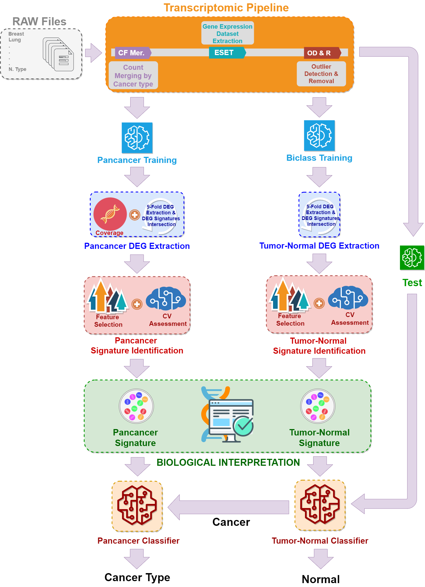

# PanCancerClassification
Repository to store the Pancancer code and data to replicate the study. The research presents an approach for pancancer diagnosis based on gene expression analysis that determines a reduced set of 12 genes, which makes it possible to distinguish between the main 14 cancer diseases by their current impact rate. The designed pipeline to achieve our goal can be seen below:

